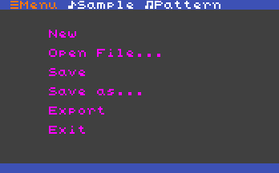
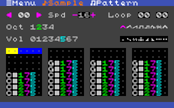
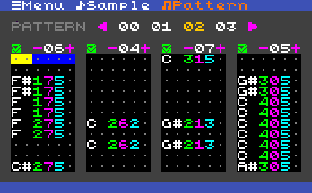

#  ChiptuneTracker

> ChiptuneTracker is a tiny chiptune tracker where you can create song and sound effects with simple oscillator's instruments.

## Screenshots

### Menu view

### Sample view

### Pattern view

## Todo list

- [x] Export to audio format
- [x] Finish the modification saving system
- [x] Adding the screenshot system
- [ ] Change the Speed system
- [ ] Change to qwerty keyboard mapping
- [ ] Remove the auto open file test
- [ ] Add Effects system
- [ ] Write the "How to use"